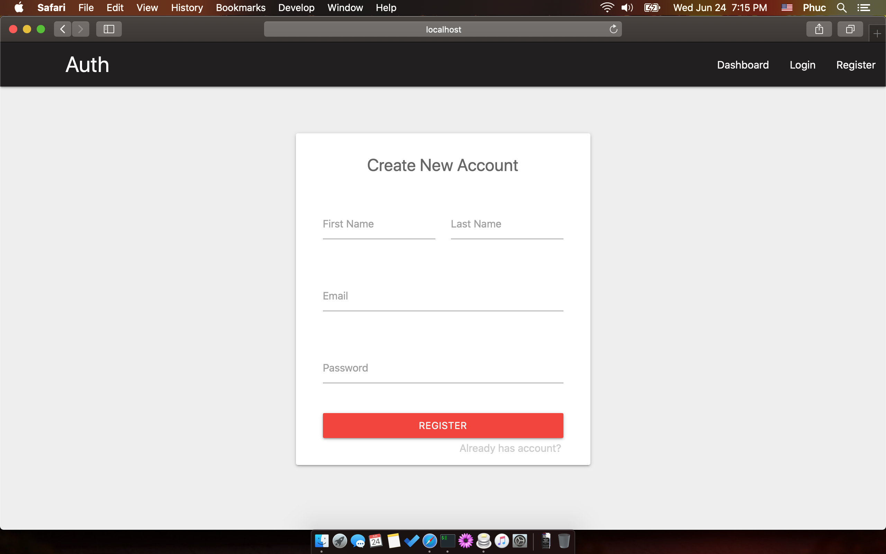

# extract login demo

# How to setup
- Backend API
```bash
cd api
cp .env.example .env
composer install
```

- webapp
```bash
cd webapp
npm i

# change backend URL in file webapp/src/utils/axios.js

npm start
```


